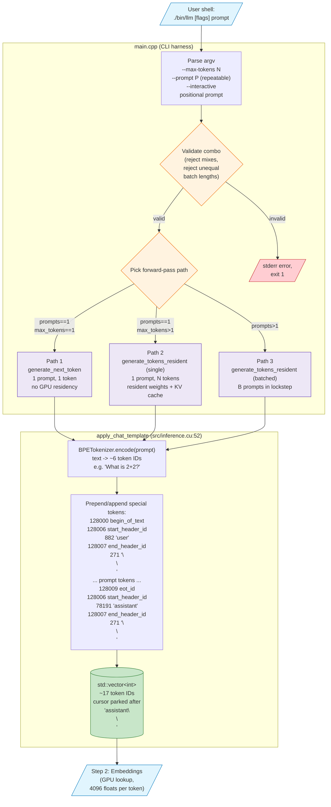
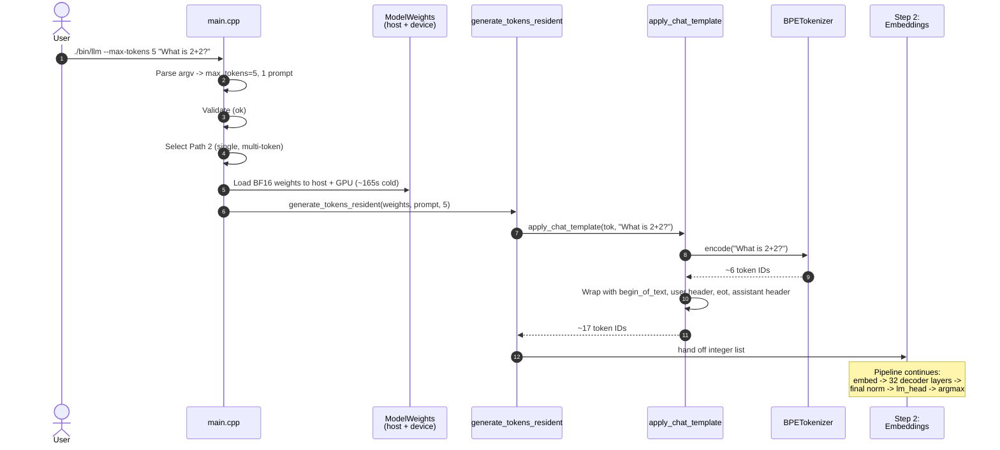

# Step 1 — CLI Entry + Chat Template

End-to-end view of what happens between the user typing `./bin/llm "..."` and the wrapped token-ID list arriving at step 2 (embeddings).

## Sequence view (Path 2: `--max-tokens 5 "What is 2+2?"`)

